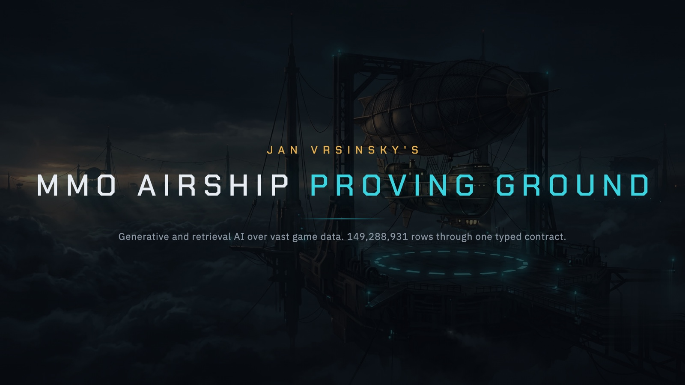

# MMO Airship Proving Ground
### Generative and retrieval AI over vast game data

**A contract-blind LLM drafts warships from a single sentence. A grounded assistant answers questions across 149,288,931 rows by citing the exact rows it stands on.** One typed contract judges every row that moves, on the way in and on the way back out. This is the data brain of a strategy MMO: AI that creates game data, and AI that reads it back at scale.

**[▶ Watch the whole system run, end to end](#demo)** · two minutes, no narration: fragmented sources become one store of 149,288,931 rows, one sentence becomes a rule-legal warship, a legal-looking hull is refused for busting its tier budget, and the read engine answers by citing the rows it stands on.


Meridian is invented. The setting, the factions, the ships, and every row of data in this project are synthetic, generated end to end from one fixed seed. The engine that generates and validates them is private. What runs, and where, is named below.

---

## The system at a glance

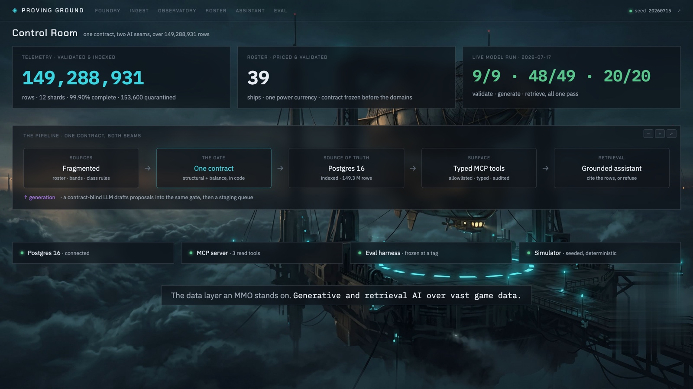
<sub>One contract, two AI seams, over 149,288,931 rows. Generation and retrieval across one validated store, in a single console.</sub>

## Demo

https://github.com/user-attachments/assets/8fbdf648-029e-4575-bb36-c7fa255dfacf

**What to watch:** the contract is the spine of every scene. Fragmented sources reconcile into one store and the telemetry odometer settles at 149,288,931 rows. A single sentence goes into the foundry and comes back as a hull the validator accepts, drafted by a model that never saw the rules it is judged against. The next hull is legal on every individual stat and still refused, because together they exceed its tier budget. The read engine answers by citing the row ids it stands on, and refuses when the rows are not there. Nothing reaches the roster without a person approving it.

## What this proves

Two AI capabilities that a modern game-data team actually needs, built on one spine and shown running live over real volume.

**Creation.** A model turns one plain-English sentence into a complete, rule-legal warship: stats, tier, faction, role, all of it. It drafts blind to the rules it will be graded against, so a good draft is a real result, not a rubber stamp.

**Retrieval.** A grounded assistant answers questions over 149,288,931 rows of combat telemetry and a live roster, and every answer names the exact rows it came from or refuses out loud. No plausible guessing. The answer is only ever the data.

**Vast.** 149,288,931 rows landed in an indexed Postgres from 38,400,000 simulated battles, streamed in across 12 parallel shards, every row validated on the way in. Both AI seams run over that store, not a toy fixture.

**One contract underneath.** The same typed contract that validates a 149-million-row ingest also grades a model's proposal and shapes every query the assistant can ask. Creation and retrieval never drift apart on what "valid" means, because they call the same code.

On 2026-07-17, an LLM ran behind both seams for real, one pass, no retries, and the receipts are below.

## The receipts

Every figure here was produced by the system on 15 to 17 July 2026, over data it generated itself.

**Creation, live.** An LLM drafted a warship for each of 49 frozen briefs in one pass, called through a headless CLI, given only the sentence and the public card shape, never a band, a budget, or a role rule. It read every brief correctly: 49 of 49 on all four structured axes (class, tier, rarity, faction), 0 unparseable responses. Against the hidden balance envelope it went 1 of 49 rule-legal (brief-003, "Cirran Vigil Ascendant"), and the same `validate` battery that guards ingest blocked the other 48, each with its reason. That split is the architecture working exactly as designed: a model that understands every brief still cannot hit an envelope it was never shown, and the contract is what decides. Median call 15.6 s, prompt template sha `0936e6e4`.

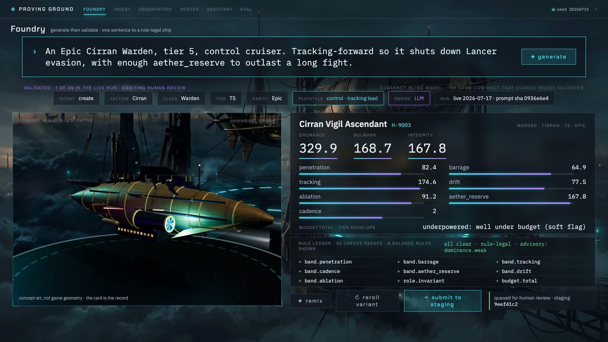
<sub>The foundry, on the live run. One sentence in, the one rule-legal card of 49 out: Cirran Vigil Ascendant, drafted by a contract-blind LLM, graded by the same battery that guards ingest.</sub>

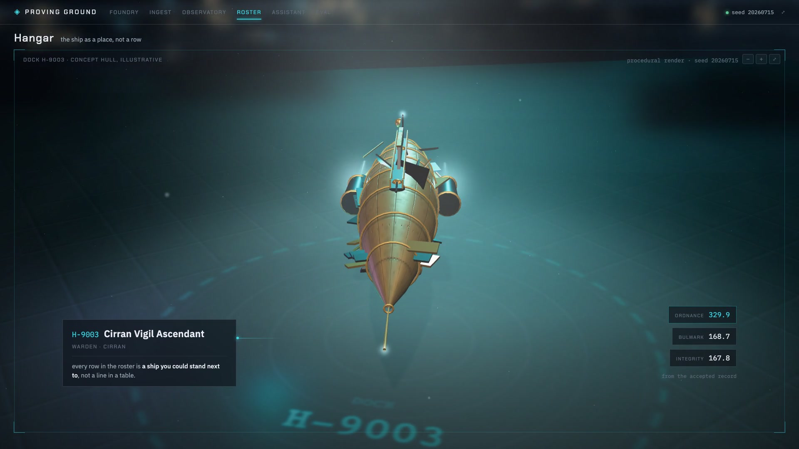
<sub>The same ship, as a place instead of a row: H-9003 Cirran Vigil Ascendant, the one draft of 49 that cleared the envelope, on the pad.</sub>

**Retrieval, live.** With the LLM engine on, an LLM planner and synthesis running over live Postgres, the committed gold set came back 20 of 20 grounded against a target of 18, every answer citing exactly the right row ids. The showcase exchange is one grounded aggregate over all 149,288,931 telemetry rows, counted at ask time: miss 680,194, hit 103,862,912, crit 6,354,465, kill 38,391,360, summing to exactly 149,288,931. Cite-or-refuse is enforced mechanically, in the filter algebra itself, so a question outside the allowlisted surface has no path to a made-up answer. Planner template sha `ff479742`, synthesis template sha `e0c50e43`.

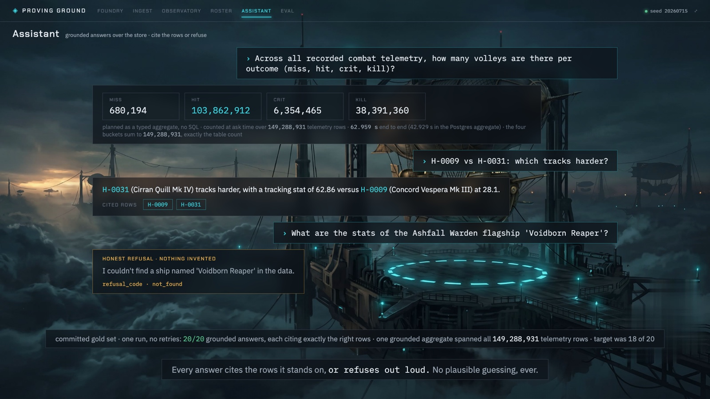
<sub>The live read engine, an LLM behind typed tools. Every answer cites the rows it stands on, including the grounded aggregate over all 149,288,931 telemetry rows.</sub>

**149 million rows, loaded clean.** From 38,400,000 simulated battles, 149,442,531 rows were generated across 12 parallel shards and 149,288,931 landed in the indexed table. 153,600 rows carried injected structural defects; every one was quarantined with the contract's exact reason code, not one silently dropped. Completeness 99.90%. The telemetry stream calls the same `validate` and lands in the same store as the ship roster: one contract, two wildly different datasets, no second engine.

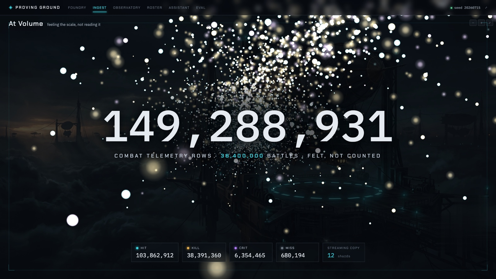
<sub>149,288,931 rows as volume, not a number on a card: every point a combat event, colored by outcome, felt at the scale it actually is.</sub>

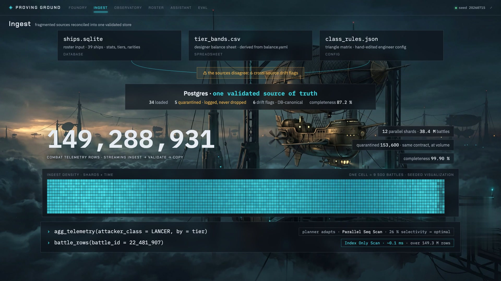
<sub>Three sources that disagree, reconciled into one store, and the same contract path carrying telemetry to 149,288,931 rows.</sub>

**Selective access over 149.3 million rows is an Index Only Scan with zero heap fetches.** A single-battle lookup against the full table is answered by the index alone, the heap never touched, in a tenth of a millisecond. Straight off EXPLAIN:

```text
Aggregate  (cost=405.53..405.54 rows=1 width=8) (actual time=0.103..0.104 rows=1 loops=1)
  Buffers: shared hit=8
  ->  Index Only Scan using ix_ct_battle on combat_telemetry  (cost=0.57..404.53 rows=400 width=0) (actual time=0.069..0.098 rows=1 loops=1)
        Index Cond: (battle_id = 12345)
        Heap Fetches: 0
        Buffers: shared hit=8
```

At volume the planner does the right thing on its own: a bulk rollup filtering roughly a quarter of the table runs as a parallel sequential scan, the correct plan, because an index over a quarter of a table earns nothing. The design is right at both ends of the selectivity curve.

**The fast path is the slow path, proven.** Validating 149 million rows through a per-row model instance is the obvious bottleneck. The fix was a fast structural validator, proven row-for-row equivalent to the full contract on a 234,017-row sample, zero mismatches across both the clean and the quarantine partitions, and the rare malformed rows still come back carrying the contract's own reason codes. That equivalence bought roughly 11x on the ingest path with the validation guarantee fully intact. 149,288,931 is an honest number because the equivalence was run before the number was quoted.

**The balance model predicts the simulation.** Over 600,000 simulated battles and 2,333,277 loaded telemetry rows, all nine class-matchup cells land within 2 points of prediction, zero cells flagged. These are not one computation checked against itself: the prediction is the deterministic pricing physics, the observed rate is derived from simulated races carrying variance the price cannot see, and agreement across all nine cells is a genuine cross-check of pricing against emergent outcome. The estimators behind that block are pinned by a committed golden hash, so any drift in their math fails the suite loudly.

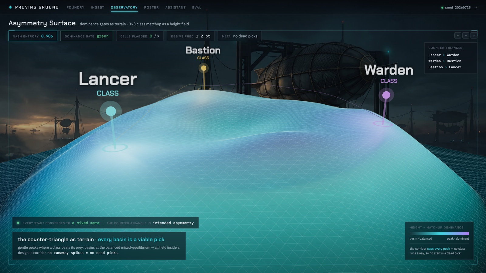
<sub>The class matchup as terrain: gentle peaks where a class beats its prey, a basin at the mixed equilibrium, every rise capped inside a designed corridor. No runaway, no dead pick.</sub>

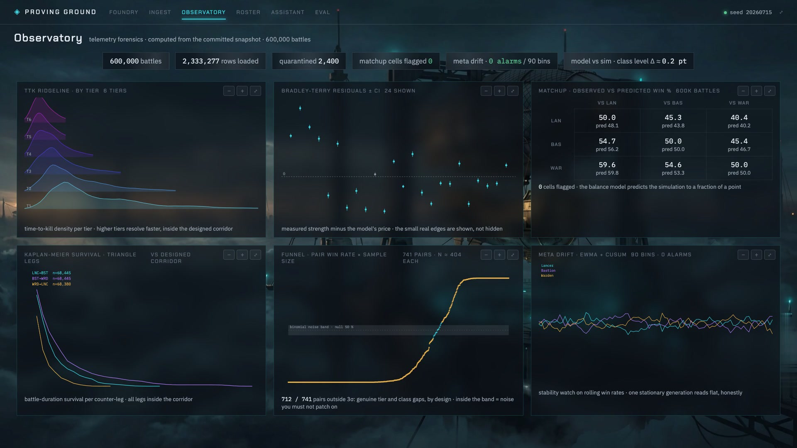
<sub>The observatory. Every panel is computed from the committed snapshot of 600,000 simulated battles.</sub>

**The validator catches 9 of 9 injected defects, each for the exact right reason, with 0 false alarms across 25 clean controls.** Recomputed live on every run, never read from a cache. The 25 negative controls are what make it a measurement rather than a validator that simply rejects everything, and two of them sit at the exact boundary of legal.

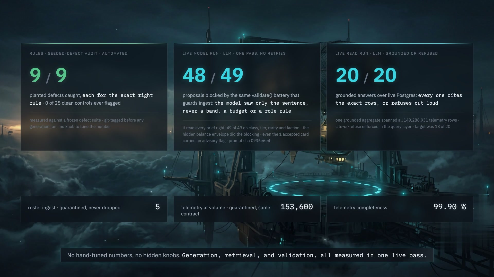
<sub>The receipts, measured live: 9 of 9 defects caught, 48 of 49 proposals blocked, 20 of 20 answers grounded.</sub>

**Every artifact regenerates from one seed.** The balance sheet hashes to a committed checksum, asserted three ways: the generator is byte-deterministic, its output matches the hash, and the file on disk equals what the generator emits. A re-tune is a deliberate act, never an accident.

**The contract was frozen before the domains existed.** The core package was tagged before any game vocabulary was written, and its diff against that tag is a single docstring line from a rename. The eval harness was frozen the same way and its diff is empty. The domains were built against the contract; the contract was never bent to fit the domains.

**Two metrics, never blended.** The eval reports the model and the code separately, and the report object refuses to collapse them into a single number. One score is about the AI, one is about the engineering, and averaging two things with different owners is exactly the move this harness is built to reject. Strict type checking is clean across the tree and both test suites are green.

Correctness at volume, not benchmark theatre: the scale claims are about plan shape and honest validation at 149 million rows, and the live-run wall clocks are provenance that the run was real.

## What actually runs

The moving parts, named, because a repo that shows you results owes you the machine that produced them.

- **Postgres 16, in Docker, as the source of truth.** Two data tables (a mutable roster upserted on its natural key, an append-only combat telemetry stream) plus two honesty tables: `quarantine` for structurally malformed rows ingest refused, `drift_flag` for loaded-but-drifting rows. Every index exists to serve a query the read side actually issues.
- **A streaming ingest path that filled it.** 12 parallel shards, each a disjoint battle range, concurrent COPY batched at 1,000,000 rows per commit. The stream is never materialized, so memory stays constant no matter how far the row count goes.
- **A FastAPI service** exposing the same typed functions the tool surface calls over MCP: a whitelist of columns and operators, a parameterized predicate, an audit entry per call, and a refusal with a reason code for anything outside the surface.
- **A real MCP server**, built on the official SDK, registering three read tools with typed input schemas and a column allowlist checked at the edge. No write tool exists to call.
- **A grounded assistant with a live LLM engine.** A deterministic router over three typed question shapes ships as the default, and behind the same protocol seam a live LLM planner and synthesis engine, opt-in via `ASSISTANT_ENGINE=llm` and exercised for real on 2026-07-17. Either engine answers from rows it actually read or returns a `cannot_express` refusal, because cite-or-refuse is enforced in the query layer, outside anything that could decide to be generous.
- **A Vue 3 review interface** over the typed API: the agent surface only reads, and the one write in the whole system is a human clicking approve.
- **A seeded simulator** running battles at volume, so the balance model can be checked against outcomes instead of trusted.
- **An eval harness**, frozen at a tag, reporting two labeled metrics that never blend.

This is the data layer an MMO stands on, built as its own system: no players, no sessions, no live service, on purpose. It is the layer where the interesting failures live: fragmented sources that disagree, a unit that is legal on every axis and still broken, a proposal that no single rule catches.

## What it is

A game-data system with two halves that share one contract.

The **read** half takes deliberately fragmented sources that disagree with each other, validates every row against a typed contract, and lands them in the indexed store that becomes the only source of truth. Structural defects are quarantined with a named reason code. Balance defects are a different severity: they load, stay queryable, and raise a drift flag, because a number that is legal but wrong is a design conversation, not a parse error.

The **generate** half is the headline. A designer types one sentence. The system parses it into constraints, prices a proposal against the balance model, and runs it through the same contract the ingest path uses, plus a dominance lint and a simulation screen. A rule ledger shows every check, and the proposal lands in a staging queue.

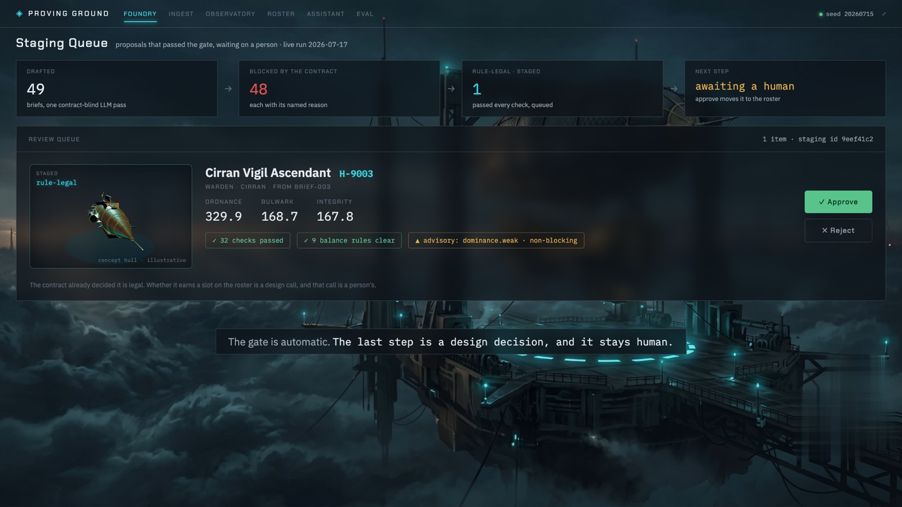
<sub>The staging queue on the live run: 49 drafted, 48 blocked by the contract, 1 rule-legal and queued. The gate is automatic; the last call is a person's.</sub>

**The model is the swappable part, and that is the design, not a gap.** The proposer is deliberately blind to the contract: it drafts from the public design model and never from the validator's rules, so a draft is graded by `validate` rather than passed by construction. The read side routes questions through a planner protocol. Both seams exist so a model drops in behind the same gate without the gate changing, and on 2026-07-17 that stopped being a promise: an LLM ran behind both seams, opt-in (`MERIDIAN_LLM_PROPOSER=1`, `ASSISTANT_ENGINE=llm`), one pass. The default build stays deterministic and model-free, so CI never depends on a model.

That ordering is the whole argument. Getting a model to invent an airship is the easy half, and it already works everywhere. The hard half is the machinery that prices the airship in one currency, catches it when it is legal on paper and dead on arrival in play, and reads it back correctly across 149 million rows. That machinery is what got built, and it is what those rows went through.

## How it works

The architecture is a short list of design decisions, each one frozen before the domain that would have bent it existed.

**One engine, and it names no game.** The core package is domain-free by construction. No game noun appears in any identifier or any branch, so the vocabulary can only live in data files. That is what let the same contract path carry a second, wildly different dataset, combat telemetry at 149 million rows, without touching the engine.

**One contract, two policies, keyed on severity.** Ingest and generate call the same `validate`. Ingest quarantines what fails; generate blocks it. The severity table decides which, so the two paths can never drift apart on what valid means. A validator that agrees with itself is the cheapest correctness property in the system and the one most demos skip.

**Bands are necessary and not sufficient.** Every stat has a guardrail on its own axis, which catches the obvious. The interesting failure is the unit whose every stat sits legally inside its band and whose total still exceeds what its tier is allowed to spend. Local bands cannot see that; the global budget can, and when they conflict the budget wins. Eight green rows and one red total is what a real balance failure looks like.

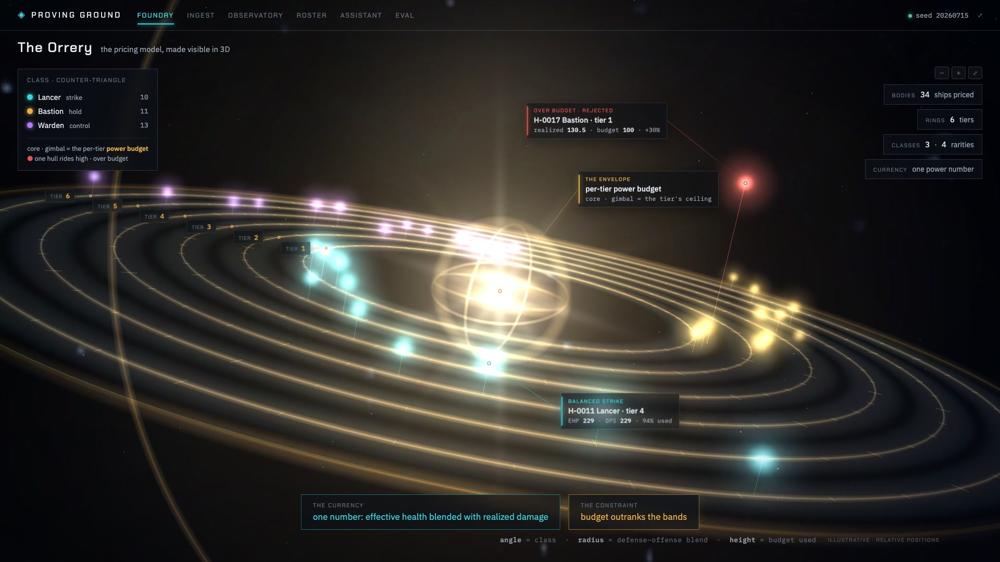
<sub>The pricing model made visible: every ship a body orbiting the tier power budget, its orbit set by the blend of effective health and realized damage. The one riding high on a red line is over budget.</sub>

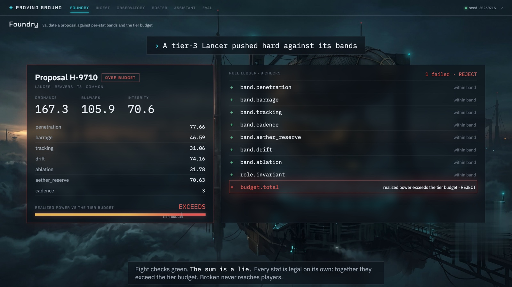
<sub>Eight green, one red. Every stat legal on its own axis, the total still rejected. This is what a real balance failure looks like.</sub>

**Legal is not the same as good, so the simulator gets a vote.** A rule-legal proposal can still be a trap pick: smaller or equal on every axis than a cheaper ship already on the roster, so nobody would field it. A dominance lint catches it in effect space and a simulation catches it in play.

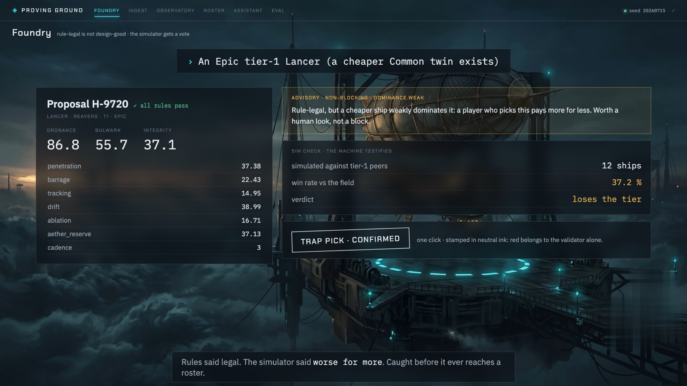
<sub>Rule-legal, and still a trap pick: a cheaper ship does the same job. The lint and the simulator build the case.</sub>

**The proposer is blind to the judge.** Whatever drafts a stat card, the seeded stand-in by default or an LLM on the 2026-07-17 live run, never sees the validator's bands, budget, or role rules. It drafts from the design model and gets graded afterwards. A generator that can read the rules it will be scored against passes by construction and teaches you nothing about whether the rules work. The live run is the cleanest demonstration here: the model extracted all four structured axes from 49 of 49 sentences and still went 1 for 49 against the envelope it was never shown.

**Grounded or refused, never approximated.** Answers come from rows or they do not come. A query that cannot be expressed against the allowlist returns a refusal with a reason code, not a plausible guess. The filter algebra composes a parameterized predicate from a whitelist of columns and operators, so a question outside that surface has no path to an answer. The refusal is structural, and it held with a model in the loop: on the live run the LLM engine, graded by the same mechanical cite-or-refuse, went 20 of 20 grounded over live Postgres.


<sub>The live read engine, an LLM behind typed tools, citing the rows behind every answer including the aggregate over all 149,288,931 telemetry rows.</sub>

**One rollup, two backends.** The in-memory store filters in Python; Postgres composes the identical predicate into parameterized SQL and rides an index. A caller never learns which one it holds. Values ride as bind parameters and never touch the SQL text, so the composer that was frozen at the tag is the one executing against real SQL at 149 million rows.

**A gate that survives the model.** Approval from a human is one path into the roster, and the red and green on screen are reserved for validator verdicts and nothing else, so someone watching with the sound off cannot misread a warning as a bug. It is the part of the design that still has to exist after a model arrives, and on 2026-07-17 one did, behind both seams, without the gate changing.

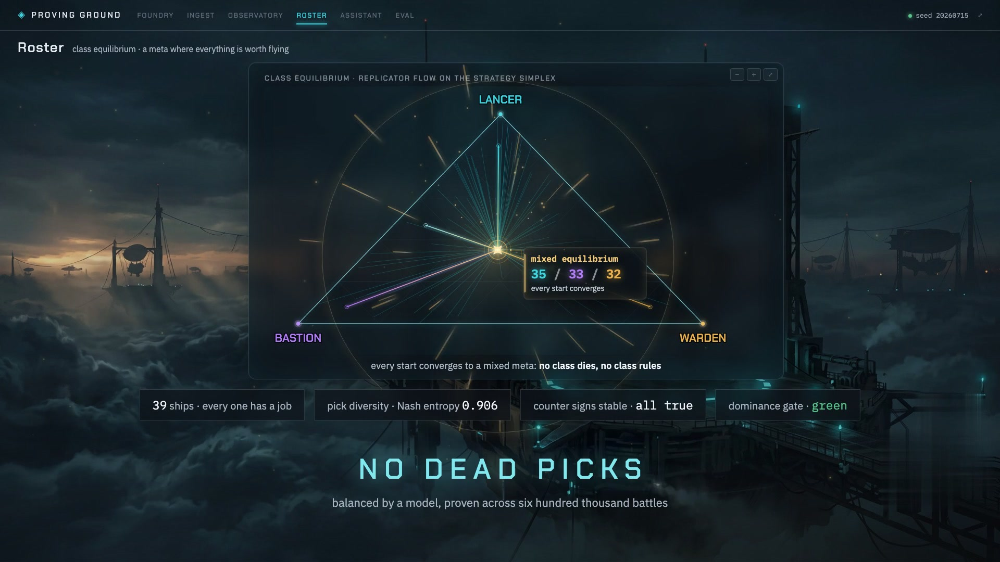
<sub>What the roster is for: every start converges to a mixed meta, so no class dies and no class rules. Nash entropy 0.906, dominance gate green.</sub>

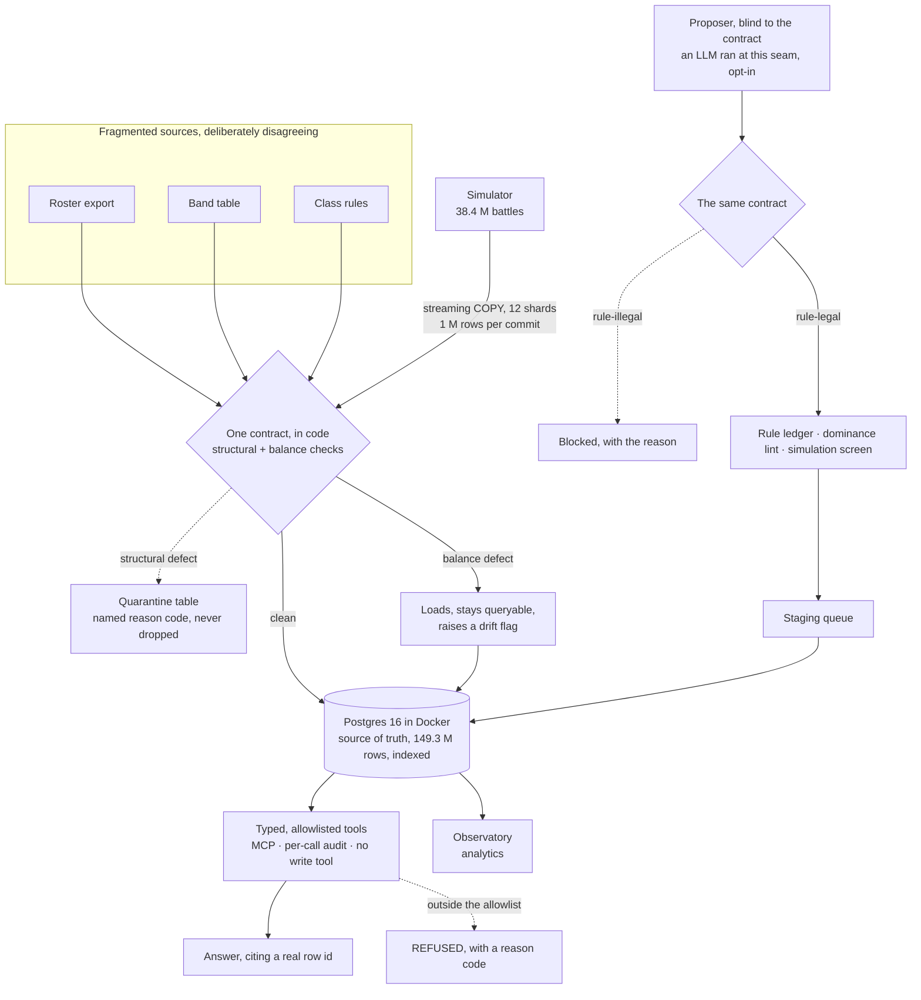

## Run the contract shape yourself

The two-tier severity model is the load-bearing idea in the whole system, and it is small enough to hand over outright.

```bash
python3 examples/ingest_contract_concept.py
```

```text
==============================================================================
 INGEST CONTRACT CONCEPT | MMO Airship Proving Ground
 clean-room re-creation, synthetic rows, standard library only
==============================================================================

 CONTRACT
   outcome ......... crit | hit | kill | miss
   faction ......... Ashfall | Cirran | Concord | Reavers
   hull id ......... H-#### exactly
   required ........ all 8 fields present
   integers ........ battle_id, event_id, tick (tick nonnegative)
   referential ..... attacker_hid is not defender_hid

   No band, budget, or tuning rule appears above. The real contract
   carries those too; this sample deliberately does not.

------------------------------------------------------------------------------

   source .............. sample_rows.jsonl
   rows read ........... 21
   loaded .............. 13
   quarantined ......... 8
   drift-flagged ....... 3
   completeness ........ 61.90%

------------------------------------------------------------------------------
 QUARANTINED | structural defect, decidable from the row alone
   The row cannot be trusted to mean anything, so it does not load.
   It is held under a named reason code. Nothing is silently dropped.
------------------------------------------------------------------------------
   battle   event   reason                   offending value
    12346    1103   unknown_outcome          outcome 'obliterated'
    12346    1104   malformed_hull_id        attacker_hid 'H-12'
    12346    1105   unknown_faction          defender_faction 'Vanguard'
    12346    1106   non_integer_field        tick '5'
    12346    1107   negative_tick            tick -1
    12346    1108   missing_field            defender_hid (absent)
    12346    1109   self_engagement          both hulls are H-0203
        ?       ?   unparseable_row          line 21, not JSON

------------------------------------------------------------------------------
 DRIFT FLAGGED | legal, loaded, still queryable
   These rows are well formed, so no gate could have refused them.
   posthumous_actor is the case that argues for the design: the row is
   clean, and the row that killed the actor is a different row, so the
   defect exists only once both are in the store.
------------------------------------------------------------------------------
   battle   event   reason                   offending value
    12345    1005   posthumous_actor         H-0102 acts at tick 4, died at 3
    12347    1201   same_faction_engagement  Concord engaged Concord
    12347    1202   same_faction_engagement  Concord engaged Concord
==============================================================================
```

It ingests a small bundled batch of synthetic telemetry rows, some clean, some structurally malformed, some legal but suspicious, and applies the engine's two-tier severity rule: a structural defect is quarantined with a named reason code and never silently dropped, while a soft defect loads, stays queryable, and raises a drift flag. Standard library only, Python 3.9+, no dependencies, no install.

The `posthumous_actor` case is the one worth stopping on: a row that is perfectly well formed, so no gate could have refused it, and that only becomes a defect once it sits next to the row that killed its actor. You cannot quarantine what you can only see downstream. That is why the drift pass runs as a query over the loaded store rather than as a check at the door, and it is why the system needs two severities rather than one.

## Stack

| Component | Purpose |
|---|---|
| **Python 3.11, typed end to end** | The engine, the domains, the generator, the eval harness. Strict type checking is a gate, not an aspiration. |
| **A typed contract layer** | One definition of valid, called by both the ingest path and the generate path. The severity table is what makes them behave differently without disagreeing. |
| **Postgres 16, in Docker** | The source of truth. Indexed, streamed into by concurrent COPY across parallel shards, and read through the same typed rollup the in-memory store answers, so the store is swappable and the query shape is not. |
| **Typed, allowlisted tools over MCP** | The only surface an agent gets, on a real MCP server built with the official SDK. A whitelist of columns and operators, a parameterized predicate, an audit entry per call. No write tool is registered, so the agent can read but never mutate. |
| **A typed FastAPI service** | The same typed functions the tool surface exposes over MCP, served over HTTP. One tool surface, two transports. |
| **A fixed-seed generator** | Every artifact regenerates byte-identically from one seed, with a committed checksum asserted by tests. Provenance is mechanical rather than remembered. |
| **An eval harness, frozen at a tag** | Two labeled metrics that never blend. One measures the model, one measures the code. Asking the report for a single number raises rather than averaging two things with different owners. |
| **A simulator** | Runs battles at volume so the balance model can be checked against outcomes instead of trusted. |
| **Vue 3 and TypeScript** | A review interface over the typed API. The agent surface only reads; the one write in the system is a human approving. |

The layout behind the "one engine" claim:

```text
core/         the engine. Domain-free by construction: no game noun in any
              identifier or branch, so the vocabulary can only live in data.
domains/
  ships/      the Meridian vocabulary. Classes, factions, stats, tiers,
              rarities. Data files and policy, not a second engine.
  telemetry/  a second dataset down the same contract path. 149 M rows.
eval/         two metrics that never touch. Frozen at a tag.
store/        one typed rollup, two backends: Postgres and in-memory.
service/      the read API and the MCP server.
tools/        generation and analytics.
```

## What ships here, and what stays private

The frame is the same across the portfolio: what is public is sanitized on purpose. Elsewhere the private part is real money and real data. Here it is the calibration itself, the constants, the bands, the curves, and the sheet they generate. The method is written out in the open on this page: the architecture is the teachable part, and I would rather show the reasoning than hide it. The asset is the tuning, which is why no configuration and no sheet ships next to the description.

- **What ships here.** The architecture, the design decisions and what each one defends against, the measured results, and one clean-room sample of the contract shape you can run in a second.
- **Real, and private.** The engine, the generator, the ingest path, the eval harness, the read API, and the interface all exist, and they produced every number above.
- **The fiction, fully disclosed.** Meridian, Fleets of the Shattered Sky, is a post-cataclysm sky-fleet setting, brass hulls over storm cloud. Every noun is invented and declared so you can check that nothing real leaked: three classes (Lancer, Bastion, Warden) in a counter triangle, four factions (Concord, Reavers, Cirran, Ashfall), three headline stats over six sub-stats, six tiers, four rarities, a 39-ship roster generated from one seed.

## How it is built

The design is the product, and it is mine: the invariants, the two-tier severity model, the effect-space power budget, and the balance-generation model. One author, one measured system, built and held to its own numbers. Nothing here is a mock: the machine runs, and the numbers are what it produced.

## Status and contact

**Tier: Lab.** A working, measured system, held at lab status because the calibration is the private part. It is built on the same shape as the rest of the portfolio: typed, allowlisted tools instead of raw access, a guardrail in code rather than in a prompt, and a human on anything that changes state.

**Generative and retrieval AI over vast game data.** Drafted by a model, read back at scale, judged by one contract.

Part of a portfolio of production and lab AI systems. More at **[github.com/janvrsinsky](https://github.com/janvrsinsky)**.

- LinkedIn: [linkedin.com/in/janvrsinsky](https://linkedin.com/in/janvrsinsky)
